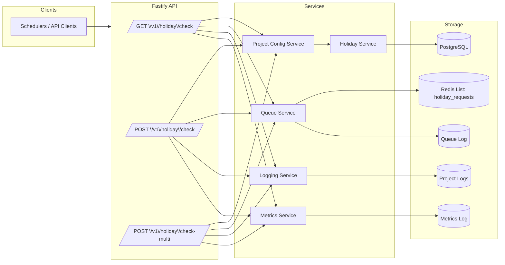

# Holiday Calendar Service - Low-Level Design (LLD)

## Purpose
This document explains where the message queue lives in the current implementation and provides a detailed low-level view of request flow, logging, and components.

## Message Queue Location
- **Queue technology:** Redis list
- **Queue key:** `holiday_requests`
- **Implementation:** [src/services/messageQueueService.ts](src/services/messageQueueService.ts)
- **Producers:** API routes in [src/routes/holidays.ts](src/routes/holidays.ts)
- **Consumers:** Not yet implemented (only enqueue + optional dequeue utility)
- **Queue logs:** `logs/queue/queue.log` (created by `logService`)

## Core Components

### 1) API Layer (Fastify)
- **File:** [src/routes/holidays.ts](src/routes/holidays.ts)
- **Endpoints:**
  - `GET /v1/holiday/check`
  - `POST /v1/holiday/check`
  - `POST /v1/holiday/check-multi`
- **Inputs:** `project_id`, `date`, `country_code`
- **Responsibilities:**
  - Validate input
  - Enqueue requests to Redis
  - Call the holiday service
  - Log request and metrics

### 2) Project Activation Config
- **File:** [src/config/projects.yaml](src/config/projects.yaml)
- **Access:** [src/services/projectConfigService.ts](src/services/projectConfigService.ts)
- **Behavior:** Rejects inactive projects (HTTP 403)

### 3) Holiday Service (DB Query)
- **File:** [src/services/holidayService.ts](src/services/holidayService.ts)
- **Logic:**
  - Checks project status
  - Queries `country` table for matching holiday
  - Returns `holiday_name` and working-day flag

### 4) Database Access
- **File:** [src/db/pool.ts](src/db/pool.ts)
- **DB Schema:** [src/db/schema.sql](src/db/schema.sql)
- **Tables used:** `region`, `country`

### 5) Queue Service
- **File:** [src/services/messageQueueService.ts](src/services/messageQueueService.ts)
- **Operations:**
  - `enqueueRequest()` pushes JSON to Redis list
  - `dequeueRequest()` pops JSON from Redis list
- **Logging:** Writes queue events to `logs/queue/queue.log`

### 6) Logging
- **File:** [src/services/logService.ts](src/services/logService.ts)
- **Outputs:**
  - `logs/<project_id>/requests.log` - request/response entries
  - `logs/queue/queue.log` - queue enqueue/dequeue events

### 7) Metrics (per minute)
- **File:** [src/services/metricsService.ts](src/services/metricsService.ts)
- **Outputs:**
  - `logs/metrics/<project_id>.log` - per-minute count and latency stats

## Runtime Architecture (LLD Diagram)

## Detailed Request Flow
1) Client calls one of the holiday endpoints with `project_id`, `date`, `country_code`.
2) API validates fields and checks project status via `projects.yaml`.
3) API enqueues the request into Redis `holiday_requests`.
4) API queries the DB for a matching holiday date for the country.
5) API returns working-day status and holiday name (if found).
6) API logs request/response and per-minute metrics.

## Notes
- Queue is currently used for tracking and audit only. A background worker can be added to consume `holiday_requests` for asynchronous processing if required.
- Logs are written to host path via Docker bind mount `./logs:/app/logs`.
